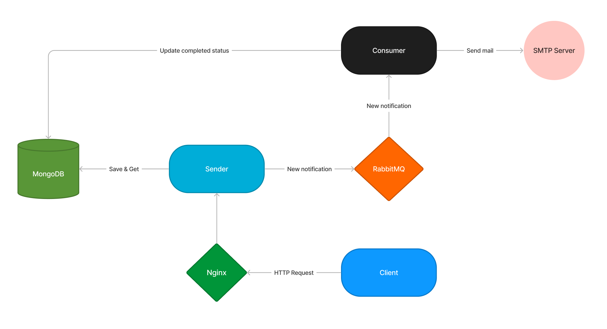

# Notification microservice

Notifier is an example of a simple notification microservice. It is written in the `Golang` language. It uses `RabbitMQ` for message broker and `MongoDB` to store data.

## Contents <div id="contents"></div>
- [Contents](#contents)
- [Service scheme](#service_scheme)
- [Start app](#start_app)
- [Start tests](#start_tests)
- [API Documentation](#api_documentation)
  - [API Constitution](#api_constitution)
      - [Request-response scheme](#api_scheme)
      - [Error codes](#api_errors)
  - [Endpoints](#endpoints)
      - [New notification](#new_notification)
      - [Get notification](#get_notification)
      - [Get notifications](#get_notifications)

## Service scheme <div id="service_scheme"></div>


## Start app <div id="start_app"></div>

1. Build `go.sum` files
```sh
# build for consumer
$ cd ./consumer
$ go mod tidy

# build for sender
$ cd ./sender
$ go mod tidy
```

2. Start app
```sh
# to start standard dev mode
$ make start-dev

# to start standard production mode
$ make start-prod

# to start the dev daemon
$ make start-dev-d

# to start the production daemon
$ make start-prod-d
```

## Start tests <div id="start_tests"></div>

1. Install `HTTPie` command-line HTTP client
```sh
# brew
$ brew install httpie

# apt
$ apt install httpie

# pip
$ pip3 install httpie
```

2. Start bash tests
```sh
# change access rights for `tests.sh`
$ chmode 777 ./tests.sh

# start tests
$ sh ./tests.sh
```

## API Documentation <div id="api_documentation"></div>

### API Constitution <div id="api_constitution"></div>

#### Request-response scheme <div id="api_scheme"></div>
Request format
```json5
{} // dictionary, array or other query parameters
```

Response format
```json5
// Success:
{
    "status": "success", // status success
    "data": {}  // dictionary, array or other request results
}
```

```json5
// Error:
{
    "status": "error", // status error
    "error": {
        "code": 2000, // custom error code
        "message": "" // short error description
    }
}
```

#### Error codes <div id="api_errors"></div>
| Custom code | HTTP code | Description           |
|-------------|-----------|-----------------------|
| 404         | 404       | Route not found       |
| 505         | 505       | Method not allowed    |
| 500         | 500       | Internal server error |
| 2000        | 400       | Validation error      |
| 2010        | 400       | Object not found      |

### Endpoints <div id="endpoints"></div>
#### New notification <div id="new_notification"></div>
```
Method: POST
```
```
/api/notifications/
```
Request body scheme:
```json5
{
  "to": [],      // e-mails for mailing
  "subject": "", // mail subject
  "body": ""     // mail body
}
```

Response body scheme:
```json5
{
    "status": "success",  // operation status
    "data": {
        "id": "",         // notification id
        "created_at": "", // date of create
        "updated_at": "", // date of update
        "to": [],         // e-mails for mailing
        "subject": "",    // mail subject
        "body": "",       // mail body
        "completed": true // completed status
    }
}
```

#### Get notification <div id="get_notification"></div>
```
Method: GET
```
```
/api/notifications/:id
```
Response body scheme:
```json5
{
    "status": "success",  // operation status
    "data": {
        "id": "",         // notification id
        "created_at": "", // date of create
        "updated_at": "", // date of update
        "to": [],         // e-mails for mailing
        "subject": "",    // mail subject
        "body": "",       // mail body
        "completed": true // completed status
    }
}
```

#### Get notifications <div id="get_notifications"></div>
```
Method: GET
```
```
/api/notifications/?limit=<int>&offset=<int>&to=<[]str>
```
Response body scheme:
```json5
{
    "status": "success",    // operation status
    "data": [
        {
          "id": "",         // notification id
          "created_at": "", // date of create
          "updated_at": "", // date of update
          "to": [],         // e-mails for mailing
          "subject": "",    // mail subject
          "body": "",       // mail body
          "completed": true // completed status
        }
    ]
}
```